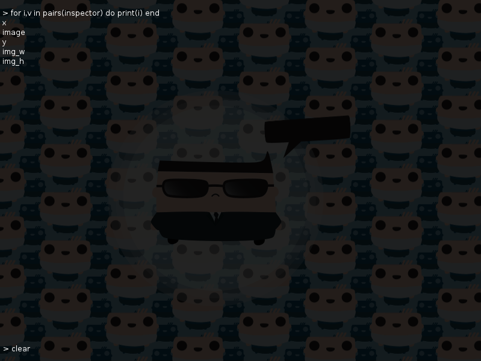

LoveDebug
=========
LoveDebug - A whole new way of debugging your game, original created by [kalle2990](http://love2d.org/forums/memberlist.php?mode=viewprofile&u=690)

Tired of having to restart your whole game when an error occurs or attaching a console, which you have to switch to, just to see your debug printings? Tired of adding extra variable in text to your graphical experience, taking space and looks misplaced? Tired of not having the possibility to execute scripts in-game without attaching a GUI or even writing one yourself? **Now all of this is unnecessary!**

LoveDebug is a community-driven open-development project, the creator has stopped posting in a while so everyone's free to do whatever they want with this code specialy adding new functionalities.

***

**Intalling LoveDebug:** 
* Put 'lovedebug.lua' wherever you want. (Ex: root of the working directory)
* Add `require('lovedebug')` to the beginning of you code in `main.lua` Ex:

```lua
require("lovedebug")

function love.load()
end
```
* Lunch your game and press Ctrl/Shift + F8
* And there you have it, your own onscreen interactive console.

## Functionalities:

**Key features:**
* Pess CTRL/Shift + F8 to Show/Hide the console.
* Type `_DebugSettings.Settings()` to see a list of available variables that you can change.
* Hotswap your code. Press F5 while you are at the console to reload your code or simply set _DebugSettings.LiveAuto to true to automaticly reload your code when it has been changed, controle the files that should be monitored by editing _DebugSettings.LiveFile
* HUD feed of everything that is going on under the under the hood of you application in real time.
* Code autocompletion. Use the arrow keys while you are coding in the console to browse a list of possible autocompletions and press tab to autocomplete the word.
* Use Shift+Arrow keys to browse input histoy.
* Copy and Past by pressing Ctrl+V/C


**Full Functionality list:**
* A scrollable list of the output.
* Some errors are reedirected to the console instead of crashing löve.
* Only prints the same error once, useful for errors in love.update, can be toggled.
* Semi-transparent console overlay, the console's color can be changed in _DebugSettings.OverlayColor
* CTRL/Shift + F8 toggle of the console
* Text input for executing lua snippets right in your console
* Graphic feedback telling about unseen lines ("..." on the bottom right)
* Variable proposal and autocomplition (select a proposal by using the arrow keys and press tab to autocomplete).
* Fast jumping to the bottom of the console by pressing lCtrl+Middle mouse button or by providing a code to the console.
* Use the home and the end keys to jump to the end or to beginning of the line.
* Browse code history by using the arrow keys while pressing the Shift key.
* LiveCoding, you can reload your code by pressing F5 while at the console or by setting _DebugSettings.LiveAuto to true and you can reload more than one file, see _DebugSettings.Settings().
* Type 'clear' and press enter to clear the console.
* Type Ctrl+C/V to copy or to past text into the console input.
* HUD with the latest prints and errors that your application emitted.
* Add your own ;)
